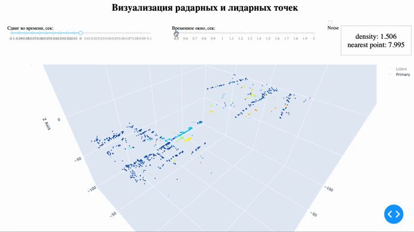
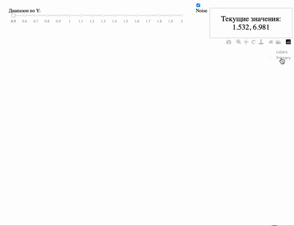
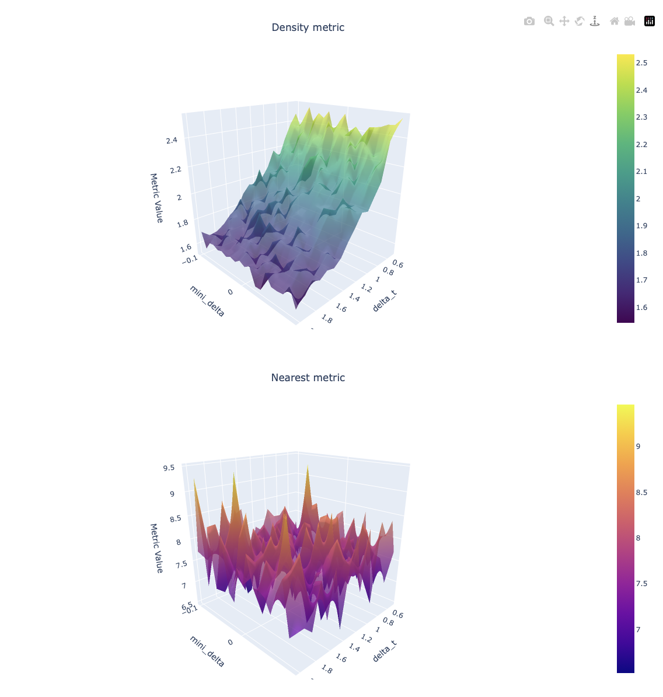
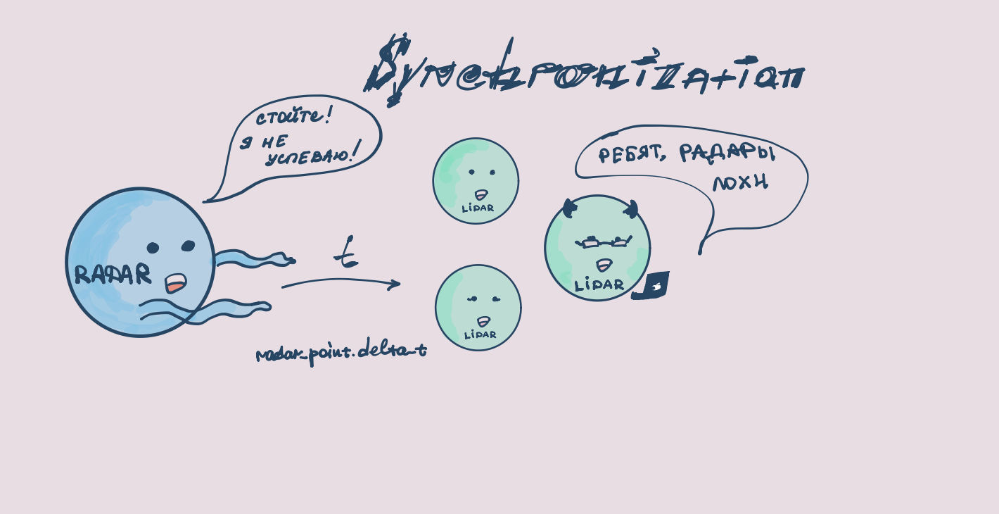

# RadArt

## Installation

```
pip install -e .
```


## Download data
```
bash scripts/download_data.sh
```

## Run scripts

### Calculate metrics:
```
python scripts/calculate_metrics.py
```
#### Additional flags:
``` 
--scene_path                    <- Path to scene 
                                   (default=data/scenes/scene_0.json)
                 
--radar_positions_path          <- Path to radar coords 
                                   (default=data/radar_positions.json

--mini_delta                    <- Time offset (sec)
                                   (default=0.06)

--delta_t                       <- Time window (sec)
                                   (default=3)

--denoise_lidar                 <- Clearing lidar points from large flat surfaces (particularly roads)
                                   (default=True)

--multiply_radar_points         <- Smooth out and multiply radar points
                                   (default=True)
                                   
--nearest_point                 <- Use nearest point metric
                                   (default=True)
                                   
--density                       <- Use density metric
                                   (default=True)
```

### Launch visualizations:
```
python scripts/visualizer.py
```

### Project architecture:
```
├── media                                      <- Photos and GIFs for README.md                                  <- Source code for use in this project.
│   ├── checkboxes.gif                            
│   ├── sliders.gif
│   ├── sufrace_photo.png
│   └── drawing.png
│                                    
├── radart                                     <- Source code for use in this project.
│   ├── __init__.py                            <- Initializes the radart package.
│   ├── core                                   <- Core functionality. 
│   │   ├── lidar_denoiser.py                  <- Removes unnecessary noise from lidar data.
│   │   └── synchronization.py                 <- Shifts radar data to a single timestamp.
│   │
│   ├── metrics                                <- Metrics for evaluation.
│   │   └── metrics.py 
│   │
│   ├── utils                                  <- Utility scripts.
│   │   └── preprocessing.py
│   │
│   └──  visual                                <- Visualization scripts.
│        ├── surface.py                        <- Surface construction.
│        └── visual_plot.py                    <- Project visualisation.
│      
│   
├── scripts                                    <- Scripts for launching tasks.
│   ├── calculate_metrics.py                   <- Run to get metric values.
│   ├── download_data.sh                       <- Run to download our dataset.
│   └── visualizer.py                          <- Run to explore the final visualization of RadArt.
│
├── LICENSE                                    <- Our MIT license.
├── README.md                                  <- The top-level README for developers using this project.
├── requirements.txt                           <- The requirements file for reproducing the project environment.
└── setup.py                                   <- makes project pip installable (pip install -e .)
```
## Website interface

```
питонячий.рф
```

### Sliders:

### Checkboxes:

### Metric surfaces:

## 
### sval9ka07's vizualization:

#
### Project creators:
1. Burzars<br />
2. sval9ka07<br />
3. MIPTestet<br />
4. sergevkim<br />
5. sayheykid<br />
6. aleksanderkarpov<br />

